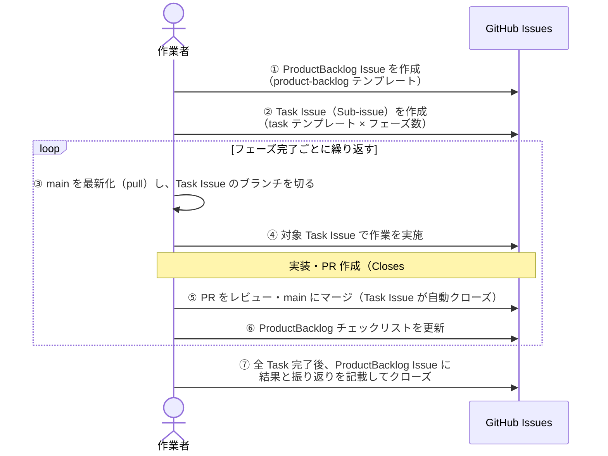
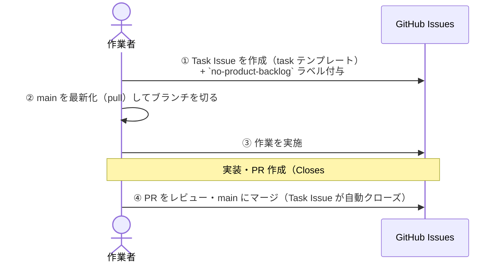

# GitHub Issue 運用ルール

> **適用対象**: life-os の全 Issue 管理

---

## 目次

1. [Issue 単位の定義](#1-issue-単位の定義)
2. [Issue の作成判断フロー](#2-issue-の作成判断フロー)
3. [状態管理（ラベル + Issue の open/close）](#3-状態管理ラベル--issue-の-openclose)
4. [ブランチ・コミット命名規則](#4-ブランチコミット命名規則)
5. [作業フロー](#5-作業フロー)
6. [依存関係の管理](#6-依存関係の管理)
7. [完了・クローズ手順](#7-完了クローズ手順)
8. [振り返り](#8-振り返り)
9. [ラベル一覧](#9-ラベル一覧)

---

## 1. Issue 単位の定義

このプロジェクトでは Issue を以下の 3 種類に分類する。

| 種別 | 役割 | テンプレート | 主な種別ラベル | 補助ラベル |
|------|------|------------|--------------|-----------|
| **ProductBacklog Issue** | 複数フェーズ・複数日にわたる作業の全体管理 | `product-backlog.md` | `product-backlog` | *(type ラベル)*, `system: *` |
| **Task Issue** | ProductBacklog の各フェーズの具体的な作業 | `task.md` | `task` または `bug` | *(type ラベル)*, `system: *` |
| **調査 Issue** | 技術調査・原因特定・要件調査 | `investigation.md` | `task` | `investigation`, `system: *` |

### ProductBacklog Issue

- アジャイルにおける **Product Backlog Item** に相当する
- 複数の Task Issue（Sub-issue）を束ねて全体の進捗を管理する
- 作業者・AI のセッションをまたいだ文脈の引き継ぎ起点となる

### Task Issue

- ProductBacklog の Sub-issue として作成するのが基本
- **例外**: 単発タスク・保守作業は ProductBacklog なしで単独作成し、`no-product-backlog` ラベルを付与する

---

## 2. Issue の作成判断フロー

### ProductBacklog Issue の作成条件

**以下をすべて満たす場合**に ProductBacklog Issue を作成する。

- 複数のフェーズ（2 つ以上）にわたる作業である
- 完了まで複数日かかる見込みがある
- 他の Issue・作業との依存関係がある

**上記を満たさない場合**（単発タスク・1 日以内の保守など）は ProductBacklog Issue を作成せず、Task Issue のみを作成して `no-product-backlog` ラベルを付与する。

```
作業の規模は？
  │
  ├─ 複数フェーズ & 複数日 & 依存関係あり
  │       ↓
  │   ProductBacklog Issue を作成（product-backlog テンプレート）
  │   └─ Task Issue（Sub-issue）を作成（task テンプレート）
  │
  └─ 単発 or 1日以内
          ↓
      Task Issue のみ作成（task テンプレート）
      + `no-product-backlog` ラベルを付与
```

---

## 3. 状態管理（ラベル + Issue の open/close）

このプロジェクトでは外部のプロジェクト管理ボードを使わず、**Issue の open/close と進捗チェックリスト、ラベル**で状態を管理する。

| 状態 | 表現方法 |
|------|---------|
| 未着手 | Issue が open で、まだブランチ・PR が存在しない |
| 進行中 | Issue が open で、対応ブランチ・PR が存在する |
| 保留中 | `on-hold` ラベルを付与（着手判断・要件確定待ち等） |
| レビュー中 | PR が open（`Closes #N` で Issue に紐づく） |
| 完了 | Issue が closed |

- **ProductBacklog Issue の進捗**: 本文の「Task Issue チェックリスト」を `[ ]` → `[x]` で更新して管理する
- ラベルは**状態ではなく分類**のために使用する（`on-hold` のみ例外的に状態を表す）。詳細は [9. ラベル一覧](#9-ラベル一覧) を参照

---

## 4. ブランチ・コミット命名規則

> **ブランチ戦略は純粋な GitHub Flow（`main` ブランチのみ）。**
> 長命ブランチは `main` だけ。作業は `main` から feature ブランチを切り、PR で `main` に直接マージする。

### ブランチ命名

```
{type}/issue-{N}-{作業名-kebab-case}
```

- `{type}` は type ラベルと一致（`feat` / `fix` / `docs` / ...）
- `{N}` は対応する Task Issue の番号
- 例: `feat/issue-12-add-travel-list`、`fix/issue-34-task-sort-bug`

| Issue 種別 | ブランチ | PR マージ先 |
|-----------|---------|------------|
| ProductBacklog Issue | **作成しない** | — |
| Task Issue | `{type}/issue-{N}-{task名}`（最新化した `main` から作成） | `main` |
| 単発 Task Issue（`no-product-backlog`） | `{type}/issue-{N}-{task名}`（最新化した `main` から作成） | `main` |

PR 本文に `Closes #Task番号` を記載することで、マージ時に Task Issue が自動クローズされる。

### ブランチ作成手順（main を最新化してから切る）

feature ブランチは**必ず最新の `main` から切る**。PR のマージで `main` は随時進むため、古い `main` から分岐すると不要なコンフリクトや古い基盤の上での作業を生む。**ブランチを切る前に必ず `main` を pull で最新化すること。**

```bash
git switch main                          # main に切り替える
git pull --ff-only                       # リモートの最新を取り込む（必ず実行）
git switch -c {type}/issue-{N}-{作業名}   # 最新化した main からブランチを作成
```

- 作業中の未コミット変更があるときは `git stash` 等で退避してから上記を実行する。
- `main` を最新化せずにブランチを切ってしまった場合は、`git rebase origin/main`（事前に `git fetch`）で最新の `main` に追従させる。
- このルールは AI（Claude Code 等）がブランチを作成する場合も同様に適用する。

### コミットメッセージ

Conventional Commits 形式を使用する。

```
{type}({scope}): {要約}
```

- `{type}` / `{scope}` は type ラベル / system ラベルと一致させる
- 例: `feat(task): タスク並び替え機能を追加`

---

## 5. 作業フロー

### ProductBacklog Issue がある場合（標準フロー）



### ProductBacklog Issue がない場合（単発タスクフロー）



---

## 6. 依存関係の管理

ProductBacklog Issue の本文に「依存関係」セクションを設け、相互リンクで明記する。

```markdown
## 依存関係

### このIssueが依存するもの
- #12 旅行リスト基盤の作成（データ構造が確定してから着手）

### このIssueに依存するもの
- #20 旅程ビューの実装（このIssueの設計完了後に着手）
```

**依存関係がある Issue を並行して進める場合**:
- 依存する成果物の完了を先に確認する
- 並行着手が必要な場合は ProductBacklog Issue のコメントに理由を記載する

---

## 7. 完了・クローズ手順

### Task Issue のクローズ

Task Issue は PR に `Closes #番号` を記載することで **PR マージ時に自動クローズ**される。
手動でクローズする場合のみ、以下の手順に従う。

1. Issue 本文の「結果」セクションに対応内容・確認結果を記載する
2. Issue をクローズする
3. 親 ProductBacklog Issue のチェックリストを更新する（`[ ]` → `[x]`）

### ProductBacklog Issue のクローズ

1. 全 Task Issue（Sub-issue）がクローズ済みであることを確認する
2. 完了条件チェックリストをすべてチェックする
3. 「結果」セクションに実現内容・作成されたリソース一覧を記載する
4. 「振り返り」セクションに、作業全体を通じた振り返りを記載する
5. Issue をクローズする

### 完了コメントの観点

Task Issue は PR マージで自動クローズされるが、**成果を Issue 単体で追えるよう、クローズ時に Issue へ「完了コメント」を残す**（自動クローズ済みの Issue にコメントしてもよい）。以下の観点を満たすように記載する。

1. **達成サマリ** — 何を実装・解決したか（1〜3 行）
2. **受け入れ基準の充足** — Issue の受け入れ基準を 1 つずつ ✅ / 該当なし で対応づける
3. **成果物・参照** — PR 番号、追加・変更した主要ファイル/ディレクトリ、関連 ADR
4. **検証結果** — `docker compose run --rm test`（pytest）/ `docker compose run --rm lint`（import 境界）の結果
5. **既知の割り切り・残課題** — スコープ外にしたこと、判明している制約
6. **派生 Issue・今後の展開** — 5 で挙げた課題や今後の方針を起票した Issue へのリンク

### 派生課題の緊急度（定性的な導出）

クローズ時に改善点・今後の方針を Issue 化する際は、`priority: *` ラベル（[9. ラベル一覧](#9-ラベル一覧)）で緊急度を表す。緊急度は次の 2 軸で**定性的に**導出する（厳密な数値化はしない）。

- **影響度**: 放置した場合に「正しさ・健全性」「品質・保守性」「利便性」のどれが、どれだけ損なわれるか
- **波及・依存**: 他作業の前提になっているか／放置で技術的負債が増えるか

| 緊急度 | 目安 |
|--------|------|
| `priority: high` | 既存の正しさ・健全性・回帰検知に関わる、または他作業の前提。放置すると壊れる／退行を見逃す |
| `priority: medium` | 機能の実用性・保守性に直結。なくても壊れないが、価値・効率を大きく左右する |
| `priority: low` | 付加価値的な拡張。あると望ましいが、なくても現行運用は成立する |

> 判断に迷う場合は「より上位の作業の前提になっているか」を優先基準とする。

---

## 8. 振り返り

### 目的

作業を通じて気づいた改善点を記録し、次の Issue・プロジェクト全体の改善につなげる。

### 振り返りの記載タイミング

振り返りは **ProductBacklog Issue のクローズ時のみ**記載する。

Task Issue は PR マージで自動クローズされるため、振り返りは記載しない。

### 振り返りの内容

以下の観点で気づいた点を記載する。振り返りがない場合は「なし」と記載してよい。

- **よかった点**: 今後も繰り返したいプロセス・判断・工夫
- **改善したほうがよい点**: プロセス・ルール・テンプレート・ツール・設計方針など
- **次回に活かすこと**: 改善点を踏まえ、次の Issue や作業で試すアクション

### AI（Claude Code 等）への指示

AI が ProductBacklog Issue をクローズする際は、以下を実施すること：

1. 作業全体を通じて改善点に気づいた場合、「振り返り」セクションに記載する
2. 振り返りがない場合は「なし」と記載してクローズする

---

## 9. ラベル一覧

ラベルは **状態ではなく分類**のために使用する（`on-hold` のみ例外）。**種別ラベル**（必須・1 件）+ **type ラベル**（必須・1 件）+ **system ラベル**（推奨・0〜複数件）の組み合わせで Issue を分類する。同一プレフィックス（`type:` / `system:`）は同じ色に統一し、UI 上のカテゴリ視認性を高める。

> **注**: GitHub Organization 機能の Issue Type は使わず、本プロジェクトでは**すべてラベルで運用する**。

### 種別ラベル（4 件・必須・1 件付与）

Issue の本質的な性質を表す。

| ラベル | 色 | 用途 |
|--------|------|------|
| `bug` | `#d73a4a`（赤） | バグ修正対応（`type: fix` と併用） |
| `task` | `#fef2c0`（薄黄） | 一般タスク（`feat` / `design` / `docs` / `chore` / `refactor` / `test` / `ci` / `perf` / `investigate` と併用）、調査 Issue を含む |
| `product-backlog` | `#bf5b17`（茶系） | 複数フェーズの親 Issue（ProductBacklog Issue） |
| `on-hold` | `#cccccc`（灰） | 保留中（着手判断・要件確定待ち等） |

### 補助ラベル（2 件）

| ラベル | 付与対象 | 説明 |
|--------|---------|------|
| `no-product-backlog` | Task Issue | ProductBacklog なしの単発タスク |
| `investigation` | 調査 Issue | 技術調査・原因特定目的の Issue |

### type ラベル（9 件・ブランチプレフィックス & コミット type と一致）

| ラベル | ブランチ | コミット type | 用途 |
|--------|---------|--------------|------|
| `type: feat` | `feat/` | `feat` | 新機能追加 |
| `type: fix` | `fix/` | `fix` | バグ修正 |
| `type: design` | `design/` | `design` | 設計作業 |
| `type: test` | `test/` | `test` | テスト追加・修正 |
| `type: docs` | `docs/` | `docs` | ドキュメント |
| `type: refactor` | `refactor/` | `refactor` | リファクタリング |
| `type: chore` | `chore/` | `chore` | ビルド設定・ツール変更 |
| `type: ci` | `ci/` | `ci` | CI/CD 設定 |
| `type: perf` | `perf/` | `perf` | パフォーマンス改善 |

> ブランチ・コミット・ラベルですべて同じ識別子を使う。

### system ラベル（6 件・コミット scope と一致）

対象領域（システム = Bounded Context）を分類する。0〜複数件付与可。
各領域の構成方針は [ADR-0002](../../docs/adr/0002-modular-monolith-bounded-context.md) を参照。

| ラベル | 用途 |
|--------|------|
| `system: task` | タスク管理 |
| `system: travel` | 旅行の行先管理 |
| `system: media` | 画像・動画管理 |
| `system: common` | 横断的・共通基盤 |
| `system: content-sales` | 自作ツール等の販売管理 |
| `system: deps` | 依存パッケージ |

> 今後 life-os の領域が増えたら、`system: *` ラベルを本表と `scripts/setup-github-labels.sh` に追加する。

### priority ラベル（3 件・任意・0〜1 件付与）

改善・派生 Issue の**緊急度**を表す。導出基準は [7. 完了・クローズ手順](#7-完了クローズ手順) の「派生課題の緊急度」を参照。緊急度の優劣を視覚化するため、本カテゴリのみ赤 → 黄 → 緑のグラデーションを用いる（`type:` / `system:` の「同色統一」の例外）。

| ラベル | 色 | 用途 |
|--------|------|------|
| `priority: high` | `#b60205`（赤） | 既存の正しさ・健全性・回帰検知に関わる／他作業の前提 |
| `priority: medium` | `#fbca04`（黄） | 機能の実用性・保守性に直結 |
| `priority: low` | `#c2e0c6`（薄緑） | 付加価値的な拡張 |

### ラベル付与の判断フロー

1. **種別ラベル（必須・1 件）**: Issue の性質に応じて以下のいずれかを付与:
   - バグ修正 → `bug`
   - ProductBacklog Issue → `product-backlog`
   - その他（一般タスク・調査）→ `task`
   - 一時保留する場合は `on-hold` を併用
2. **type ラベル（必須・1 件）**: タイトルの type と同じものを 1 件付与する（例: `type: feat`）
3. **system ラベル（推奨・0〜複数件）**:
   - 単一領域の作業 → 該当する `system: *` を 1 件付与
   - 複数領域にまたがる場合 → `system: common` を 1 件付与（または該当する複数の `system: *` を併記）
   - 領域特定不能・分類不要な場合 → system ラベル省略可
4. **補助ラベル（必要時のみ）**: `no-product-backlog` / `investigation` をテンプレートに従って付与
5. **priority ラベル（任意・0〜1 件）**: 改善・派生 Issue には緊急度に応じて `priority: *` を付与する（[7. 完了・クローズ手順](#7-完了クローズ手順) の導出基準に従う）

### ラベルの一括作成

リポジトリのラベルは `scripts/setup-github-labels.sh` で一括作成・更新する：

```bash
./scripts/setup-github-labels.sh --dry-run    # 確認のみ
./scripts/setup-github-labels.sh              # 全ラベル作成・更新
./scripts/setup-github-labels.sh --cleanup    # 廃止予定ラベルを削除
```

---

## 参考

- Issue テンプレート: `.github/ISSUE_TEMPLATE/`
- Issue 作成スキル: `.claude/skills/create-issue/SKILL.md`
- ラベル一括作成スクリプト: `scripts/setup-github-labels.sh`
- ADR（設計決定記録）: `docs/adr/README.md`
